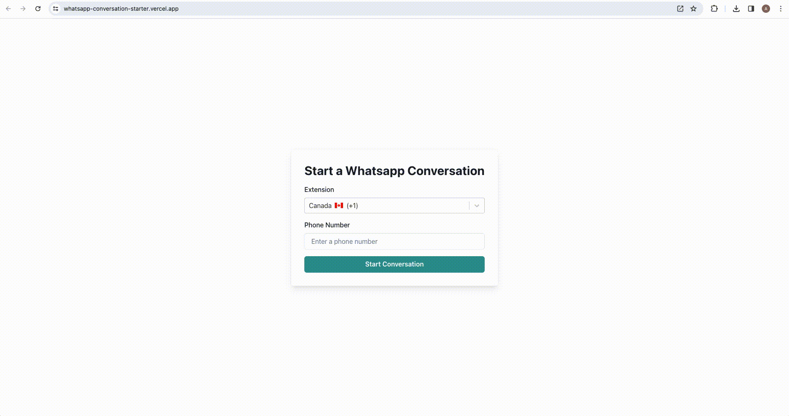

# Whatsapp Conversation Starter

Whenever you want to start a whatsapp conversation with someone, you have to add them in your contact first.

This project aims to solve this issue. You can start conversation with anyone by selecting a dial code and phone number in the application, without the need to add them in your contact.

## Demo

[**Try out the demo!**](https://whatsapp-conversation-starter.herokuapp.com/)



## Build and run

### To Run Locally:

Clone the repository and perform the following command line actions:

```bash
$> npm install
$> npm start
```

Then open http://localhost:3000 in browser.

### To Build:

```bash
$> npm run build
```

## Testing

### Jest

```bash
$> npm test
```

### Cypress

```bash
$> npm run cypress:open
```

## Tech Stacks

### Framework and Language

- ReactJS
- Typescript

### Component Libraries

- Chakra-UI
- React-Select

### Testing

- Jest
- React Testing Library
- Cypress

### Code Linter and Formatter

- Eslint
- Prettier
